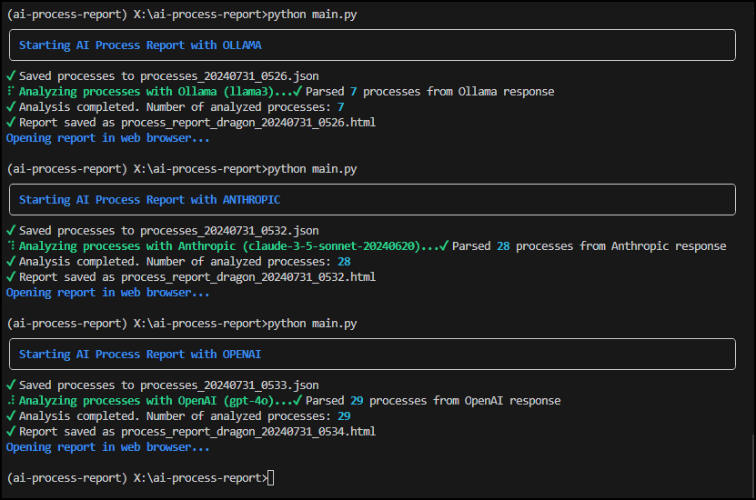

# Ai Process Report


AI Process Report is a powerful tool that analyzes running processes on Windows systems using advanced AI models. It provides detailed insights and threat assessments for each process, helping users understand their system's current state and potential security risks. The AI also provides a short detailed summery of each process and what it is used for. 

Keep it all private and local using ollama or use openai or anthropic. Fine tune your own model with a better understanding of the security threats or use RAG and provide the model with additional details regarding threat processes. Using standard models do a good job at providing a description for the processes running or stopped. 


## Features

- 🔍 Analyzes running Windows processes in real-time
- 🤖 Utilizes multiple AI providers (OpenAI, Anthropic, Ollama) for in-depth analysis
- 🚀 Supports local AI models through Ollama integration
- 📊 Generates comprehensive HTML reports with threat scores and process descriptions
- 🎨 User-friendly CLI with rich, colorful output
- Works in Windows and Linux (tested in wsl - ubuntu)

---



## Quick Start

For Windows users, a convenient `start.bat` file that sets up the environment and runs the script automatically. Here's how to use it:

1. Ensure you have Python 3.8 or higher installed and added to your system PATH.

2. Download or clone this repository to your local machine.

3. Navigate to the project directory fill in your .env and locate the `start.bat` file.

4. Double-click on `start.bat` 


The batch file will:

- Create a virtual environment if it doesn't exist
- Activate the virtual environment
- Install or update required packages
- Run the AI Process Report script

Note: On first run, it may take a few minutes to set up the environment and install dependencies. Subsequent runs will be faster.


## Installation

1. Clone the repository:

   ```bash
   git clone https://github.com/bigsk1/ai-process-report.git
   cd ai-process-report
   ```

2. Create a virtual environment and activate it:

   ```bash
   python -m venv venv
   source venv/bin/activate  # On Windows, use `venv\Scripts\activate`
   ```

3. Install the required packages:

   ```bash
   pip install -r requirements.txt
   ```

4. Set up your `.env` file with the necessary API keys and configurations:

   ```env
   AI_PROVIDER=anthropic
   ANTHROPIC_MODEL=claude-3-5-sonnet-20240620
   OPENAI_MODEL=gpt-4o
   OLLAMA_MODEL=llama3
   OLLAMA_URL=http://127.0.0.1:11434
   PROCESS_LIMIT=50
   ```

## Usage

Run the script with your preferred AI provider:

```bash
python main.py --ai anthropic
```

Available options for the `--ai` argument are:
- `anthropic` (uses Claude AI)
- `openai` (uses GPT-4)
- `ollama` (uses local Ollama model)

You can also enable debug mode for more detailed logging:

```bash
python main.py --ai openai --debug
```

## How It Works

1. The script gathers information about running processes on your Windows system.
2. It sends this information to the selected AI model for analysis.
3. The AI provides a description and threat score for each process.
4. The script generates an HTML report with the results.
5. The report opens automatically in your default web browser.
6. If the process is unknown you can click a link to do a duckduckgo search about that process.
7. Anthropic has the 8192 output tokens header listed anthropic-beta: max-tokens-3-5-sonnet-2024-07-15. to be able to use it for a large amount of processes.

## Configuration

You can customize the behavior of AI Process Report by modifying the `.env` file:

- `AI_PROVIDER`: Default AI provider to use (anthropic, openai, or ollama)
- `ANTHROPIC_MODEL`: Specific Anthropic model to use
- `OPENAI_MODEL`: Specific OpenAI model to use
- `OLLAMA_MODEL`: Specific Ollama model to use
- `OLLAMA_URL`: URL for your local Ollama instance
- `PROCESS_LIMIT`: Maximum number of processes to analyze

## Contributing

Contributions are welcome! Please feel free to submit a Pull Request.


## Disclaimer

This tool is for educational and informational purposes only. Always exercise caution when analyzing system processes and consult with cybersecurity professionals for a comprehensive security assessment.